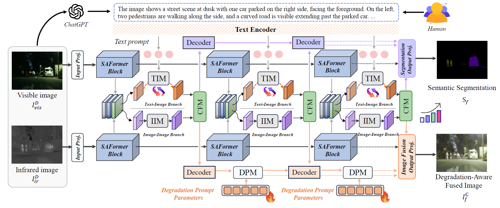

# [TPAMI 2026] GText-IF: Leveraging Text-Driven Semantics for Degradation-Aware Image Fusion
### [Paper](https://ieeexplore.ieee.org/abstract/document/11647316)  | [Code](https://github.com/XunpengYi/GText-IF) 

**GText-IF: Leveraging Text-Driven Semantics for Degradation-Aware Image Fusion**
Xunpeng Yi, Han Xu, Yibing Zhang, Hao Zhang, Linfeng Tang and Jiayi Ma in TPAMI 2026




## ⚙️ 1. Create Environment
- Create Conda Environment
```
conda create -n GText_IF_env python=3.8
conda activate GText_IF_env
```
- Install Dependencies
```
conda install pytorch==1.8.0 torchvision==0.9.0 torchaudio==0.8.0 cudatoolkit=11.1 -c pytorch -c conda-forge
pip install -r requirements.txt
```
To ensure compatibility and stability, we recommend using well-tested versions of CUDA and PyTorch rather than the latest releases.

## 📦 2. Prepare Your Dataset

The dataset is constructed by leveraging vision-language large models (VLM) and expert human priors. You can also use a wider range of models and customized approaches to create the text-image fusion dataset.

The dataset is available at MFNet [[Baidu Drive]](https://pan.baidu.com/s/12q-lw0NVrcrseU04S29ytQ)(code: rjgm), FMB [[Baidu Drive]](https://pan.baidu.com/s/1QcEwyd9-cthJhDH0PkYYlA)(code: rcgm) with image and text pairs. 

```bash
    datasets/
        your_GT_dataset/
            train/
                Infrared/
                Infrared_HQ/
                Visible/
                Visible_HQ/
                train_Label/
            test/
                Infrared/
                Infrared_HQ/ (opt.)
                Visible/
                Visible_HQ/ (opt.)
                test_Label/
        your_text/
            train_text/
            test_text/
```

If you only want to download our high-quality image pair dataset for degradation-aware image fusion development, it is available at MFNet [[Baidu Drive]](https://pan.baidu.com/s/15zvK_vNp0a5BmgoQuGYarA)(code: bprm), FMB [[Baidu Drive]](https://pan.baidu.com/s/1E5ZOzoH-z4eWkAvXmygfbw)(code: bqrm).

## 🛠️ 3. Pretrained Weights
The pretrained weights for text-guided image fusion are available at:
- **Original fusion model:** MFNet [[Baidu Drive]](https://pan.baidu.com/s/1_Gf6qRRfB9m5wqqZzkNb_g)(code: kldm), FMB: [[Baidu Drive]](https://pan.baidu.com/s/1kFSyfU7pF9xDRScWBMm3sQ)(code: klfm)
- **Degradation-aware model:** MFNet [[Google Drive]](https://drive.google.com/drive/folders/1girtEYoOQQK_LIeMODE700OwF0_2CoDr?usp=sharing) | [[Baidu Drive]](https://pan.baidu.com/s/1Rq5P3ehtCjDgxGUfKHnDQQ)(code: klgm), FMB: [[Google Drive]](https://drive.google.com/drive/folders/1phS091fRnjpl84lBKnCdYi_sjNiWggn6?usp=sharing) | [[Baidu Drive]](https://pan.baidu.com/s/1fOfsFIIN1uBxT57A6xJTzg)(code: klhm)

The pretrained weights with distilling from text guidance are available at:
- **Original fusion model:** MFNet [[Baidu Drive]](https://pan.baidu.com/s/1kTd992QjpRAhwY-TuAf2cA)(code: fgnm), FMB: [[Baidu Drive]](https://pan.baidu.com/s/15VWcoKoWohMM0k6WZl7uuA)(code: fhnm)
- **Degradation-aware model:** MFNet [[Baidu Drive]](https://pan.baidu.com/s/1SLTkuYal8Re0QjxRCWNQ3Q)(code: gfcm), FMB: [[Baidu Drive]](https://pan.baidu.com/s/1n7L0RxKhGHjPGqPsyrEfkQ)(code: gdcm)

Due to the storage limitations of the free Google Drive service, we provide only a limited number of pretrained weight versions on Google Drive. The complete set of pretrained weights is available on Baidu Drive.

⚠️ Additionally, please download the pretrained weights of Long-CLIP (or any other required models) in [[Google Drive]](https://drive.google.com/file/d/1NffjJ-IkDmkzVtLZbkGCo1bNgcXQdgJV/view?usp=sharing) | [[Baidu Drive]](https://pan.baidu.com/s/1TfydaAWL_efYQMPm9WLY_A)(code: pmdj) and place them in the corresponding directory: `long_clip/checkpoints`.

⚠️ You may also need the pretrained mit-b2 backbone model as a starting point and place them in the directory `pretrained_model`. It can be downloaded here [[Google Drive]](https://drive.google.com/file/d/1sAkfRSi-izsvpi2_ChurXi2J535q2kgL/view?usp=sharing) | [[Baidu Drive]](https://pan.baidu.com/s/1PArR3XqPyT6sQNRAnXWILA)(code: asdl).


## 🖥️ 4. Testing
Please prepare the pretrained weights in `weights` or train the model beforehand, and update the config and weights paths accordingly based on the corresponding files.

```shell
# Test Image Fusion with Text Guidance
cd GText-IF_Text

# For MFNet/FMB dataset ori./deg.-aware
python eval_text_MFNet.py --config_path ./configs/config_MFNet_fus.yaml --checkpoint_dir ./weights/MFNet
python eval_text_MFNet.py --config_path ./configs/config_MFNet_ori_fus.yaml --checkpoint_dir ./weights/MFNet_original

python eval_text_FMB.py --config_path ./configs/config_FMB_fus.yaml --checkpoint_dir ./weights/FMB
python eval_text_FMB.py --config_path ./configs/config_FMB_ori_fus.yaml --checkpoint_dir ./weights/FMB_original


# Test Image Fusion without Text Guidance by distilled model
cd GText-IF_Distill

# For MFNet/FMB dataset ori./deg.-aware
python eval_text_distill_MFNet.py --config_path ./configs/config_MFNet_fus_distill.yaml --checkpoint_dir ./weights_distill/MFNet_distill
python eval_text_distill_MFNet.py --config_path ./configs/config_MFNet_ori_fus_distill.yaml --checkpoint_dir ./weights_distill/MFNet_original_distill

python eval_text_distill_FMB.py --config_path ./configs/config_FMB_fus_distill.yaml --checkpoint_dir ./weights_distill/FMB_distill
python eval_text_distill_FMB.py --config_path ./configs/config_FMB_ori_fus_distill.yaml --checkpoint_dir ./weights_distill/FMB_original_distill

# For other dataset
python eval_text_distill_MFNet.py --config_path ./configs/Test_config_other_data_fus_distill_MFNet.yaml --checkpoint_dir ./weights_distill/MFNet_distill
python eval_text_distill_FMB.py --config_path ./configs/Test_config_other_data_fus_distill_FMB.yaml -checkpoint_dir ./weights_distill/FMB_distill
```


## 🚀 5. Train
Please prepare the training data as required.

Modify the path in the `configs` to the corresponding file and the parameters in the train files.
Run the following command:
```shell
# Training Image Fusion with Text Guidance
cd GText-IF_Text

# For MFNet dataset
CUDA_VISIBLE_DEVICES=0,1 python -m torch.distributed.launch --nproc_per_node=2 train_MFNet.py
# For FMB dataset
CUDA_VISIBLE_DEVICES=0,1 python -m torch.distributed.launch --nproc_per_node=2 train_FMB.py
```

After obtaining the full Text Guidance model, you can perform text distillation to obtain the distilled model. Please set the path to the teacher model (the model to be distilled) in the training configuration files. Then, execute the following command:
```shell
# Training Image Fusion without Text Guidance by distilled model
cd GText-IF_Distill

# For MFNet dataset
python train_MFNet_distill.py
# For FMB dataset
python train_FMB_distill.py
```
Tips: Due to token cost limitations, this implementation loads the text in a non-online generation manner. If you have sufficient token resources or powerful auxiliary tools, we recommend dynamically calling the VLM API during the dataset loading process to obtain more accurate descriptions.

- We recommend using at least two GPUs with 24GB or more of VRAM to run our code.

## Citation
If you find our work or dataset useful for your research, please cite our paper. 
```
@article{yi2026gtext,
  title={GText-IF: Leveraging Text-Driven Semantics for Degradation-Aware Image Fusion},
  author={Yi, Xunpeng and Xu, Han and Zhang, Yibing and Zhang, Hao and Tang, Linfeng and Ma, Jiayi},
  journal={IEEE Transactions on Pattern Analysis and Machine Intelligence},
  year={2026},
  publisher={IEEE}
}
```
If you use the dataset of another work, please cite them as well and follow their licence. During our implementation, we referred to many excellent works. Here, we express our thanks to them. 
If you have any questions, please send an email to xpyi2008@163.com. 